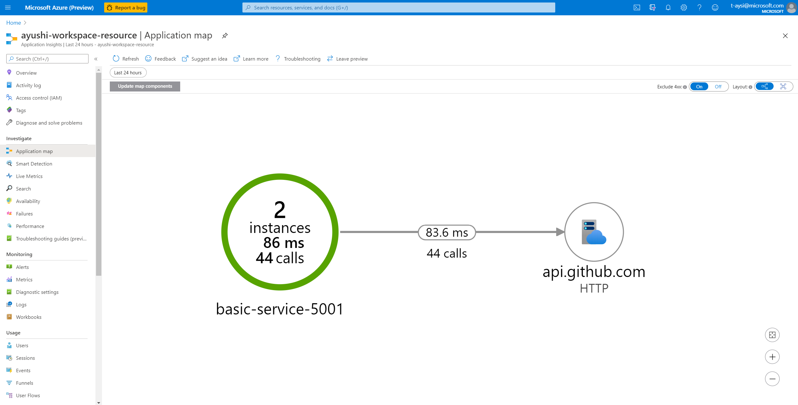

# Private Preview Instructions 
## Container Insights Agent Integration with OpenTelemetry Collector
Intended for those looking to use an integrated version of the Container Insights agent and OpenTelemetry collector (deployed as a kubernetes service) to obtain both infrastructure and application insights. This integration is currently only available with the Linux Agent. 

## Pre-requisites
1. [Workspace-based Application Insights Resource](https://docs.microsoft.com/en-us/azure/azure-monitor/app/create-workspace-resource)
2. [AzureMonitor-Containers Solution added to your Log Analytics workspace](https://github.com/Microsoft/OMS-docker/blob/ci_feature_prod/docs/solution-onboarding.md)
3. [An app instrumented with OpenTelemetry](https://opentelemetry.io/)

## Install Chart
Add the repo: 
```
helm repo add open-telemetry https://ayusheesingh.github.io/helm-chart/
```
Confirm it's been added by checking `open-telemetry` is listed:
```
helm repo list 
```
Go to your Log Analytics workspace in the Azure Portal, click on "Advanced Settings" > "Connected Sources" > "Agents management", and retrieve your workspace ID (<your_wsid>) and primary key (<your_key>) from there. Similarly, get your Application Insights resource instrumentation key (<your_instrumentation_key>) from the Overview tab in Azure Portal. Replace these values in the command below and run.
```
helm upgrade --install azmon-containers-release-1-ot --set omsagent.instrumentationKey=<your_instrumentation_key>,omsagent.secret.wsid=<your_wsid>,omsagent.secret.key=<your_key>,omsagent.env.clusterName=<your_cluster_name>  open-telemetry/azuremonitor-containers
```

## Verify Installation
Confirm `azmon-containers-release-1-ot` is listed:
```
helm list 
```
Confirm `otel-collector` is running:
```
kubectl get deployments -n kube-system
```

## Configure OpenTelemetry Collector Receiver
By default, OTLP is configured to be the receiver for the collector. If you wish to change it (for example, to OpenCensus), you will need to edit the collector configuration. Note: the OpenCensus configuration is commented out for convenience, in case you choose to use that.
To get all configmaps (to see the current collector configuration), run:
```
kubectl get configmap -n kube-system 
```
Edit the configuration by running: 
```
kubectl edit configmap <configmap-name> -n kube-system
```

## Configure application 
Make sure your app that is being instrumented with OpenTelemetry is configured to the appropriate endpoint based on the exporter you are using. If you are using the OTLP exporter, it must be specified to have `endpoint="otel-collector:55680"` (OTLP's default endpoint). If you are using the OpenCensus exporter, use `endpoint="otel-collector:55678"`.

## Verify data ingestion
Run your application, and see your traces in Application Insights. Data should be available under "Investigate" in Application Map and in Search. Below is an image of what this data can look like.



## Contact
If you run into issues, feel free to reach out to t-aysi@microsoft.com, or visit the instructions for a sample Python application in `~/Docker-Provider/source/opentelemetry-collector-contrib/examples/tracing` and confirm that you can see data coming into Application Insights.
